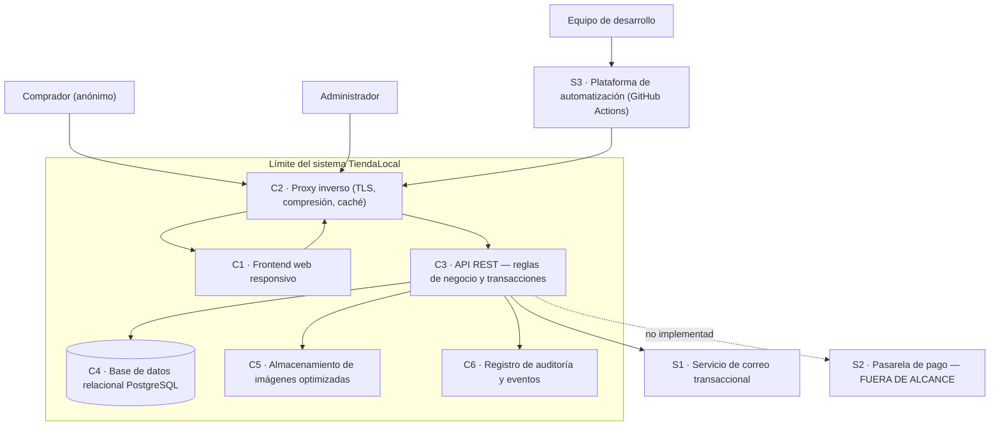
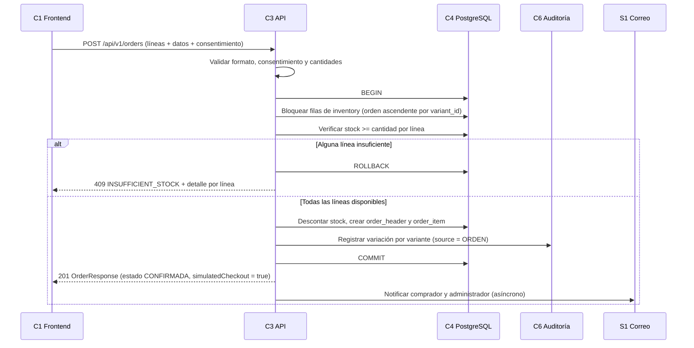

# Arquitectura

Desarrollo de la arquitectura inicial del PDF (apartado 9.3, Figura 2). Los componentes C1 a C6, los actores y los sistemas externos **provienen del documento**; el reparto interno de capas del backend y las tecnologías concretas son `DECISIÓN PROPUESTA` registradas en [`../decisiones/ADR-001-arquitectura.md`](../decisiones/ADR-001-arquitectura.md).

## Vista de contexto

## Responsabilidades por capa

| Capa | Responsabilidad | Lo que **no** hace | Responsable |
| --- | --- | --- | --- |
| **Frontend (C1)** | Renderizar catálogo, carrito, checkout y panel; gestionar estado de pantalla; mostrar errores y estados de carga; accesibilidad (RNF-03) y presupuesto de peso (RNF-01). | No contiene reglas de negocio; ninguna comprobación suya es vinculante (PDF 9.3). | Brandon Soto |
| **Proxy inverso (C2)** | Terminar TLS, comprimir respuestas, servir activos estáticos con encabezados de caché, enrutar `/api` hacia C3. | No aplica reglas de negocio ni autentica usuarios. | Jhon Ortiz |
| **API (C3 — capa de interfaz)** | Enrutamiento, validación de formato de la petición, autenticación, serialización de respuestas y traducción de errores de negocio a HTTP. | No implementa reglas de negocio ni consulta la base directamente. | Hedixon Cardozo |
| **Lógica de negocio (C3 — capa de servicio)** | Aplicar RN-01 … RN-29, orquestar la transacción de la orden, decidir estados y disparar notificaciones. | No sabe de HTTP ni de SQL concreto. | Hedixon Cardozo |
| **Persistencia (C3 — repositorios)** | Consultas parametrizadas, bloqueo de filas, manejo de transacciones. | No decide reglas. | Hedixon Cardozo |
| **Base de datos (C4)** | Garantizar ACID; restricciones de integridad (`CHECK (stock_quantity >= 0)`, unicidad, claves foráneas). | No contiene lógica de aplicación (sin procedimientos almacenados en este alcance). | Hedixon Cardozo |
| **Imágenes (C5)** | Almacenar las imágenes ya optimizadas del catálogo. | No transforma en tiempo de lectura. | Hedixon Cardozo / Jhon Ortiz |
| **Auditoría (C6)** | Conservar los eventos de inventario y de estado como evidencia. | No es reversible ni editable (RN-25). | Hedixon Cardozo |
| **Infraestructura** | Contenedores, canal CI/CD, despliegue por SSH, secretos, observabilidad básica. | No modifica el comportamiento funcional. | Jhon Ortiz |

## Dónde vive cada preocupación

| Preocupación | Ubicación única | Regla |
| --- | --- | --- |
| Validación de **formato** (tipos, obligatoriedad, rangos) | Capa de interfaz de C3, con esquemas declarativos | Respuesta `VALIDATION_ERROR` uniforme |
| Validación de **negocio** (stock, estados, consentimiento) | Capa de servicio de C3 | Códigos de error estables (`INSUFFICIENT_STOCK`, `INVALID_STATE_TRANSITION`, `CONSENT_REQUIRED`) |
| **Transacciones** | Capa de servicio abre y cierra; repositorios participan | Una transacción por caso de uso; nunca una por consulta |
| **Acceso a datos** | Repositorios, con consultas parametrizadas (OWASP A03) | Ninguna concatenación de SQL |
| **Autenticación** | Capa de interfaz de C3 | Token en cabecera `Authorization`; RN-19 |
| **Autorización** | Capa de interfaz de C3 | Único perfil autenticado; `/admin` exige sesión válida |
| **Serialización** | Capa de interfaz de C3 | `camelCase`, según `../api/convenciones.md` |
| **Manejo de errores** | Manejador único en C3 | Estructura de `../api/errores.md`; nunca trazas al cliente |
| **Cifrado en tránsito** | C2 | RNF-04 |
| **Optimización de imágenes** | C3 al cargar, almacenamiento en C5 | RN-22, RNF-01 |
| **Estado de pantalla** | C1 | Estados de `../api/frontend-backend-contract.md` |

## Flujo crítico: confirmación de orden (PDF, apartado 9.3)

El aislamiento de la transacción es lo que impide que dos solicitudes simultáneas lean el mismo valor de existencias antes de que cualquiera lo modifique (PDF, apartado 9.3).

## Controles de la arquitectura (PDF, apartado 9.3)

| Control | Componente | Requisito |
| --- | --- | --- |
| Validación transaccional | C3 + C4 | RNF-02 |
| Cifrado en tránsito | C2 | RNF-04 |
| Minimización de datos personales | Modelo de C4 | REQ-08, RNF-04 |
| Registro de auditoría | C6 | REQ-06, REQ-07 |

## Atributos de calidad y decisiones que los sostienen

| Atributo (ISO/IEC 25010:2023) | Requisito | Decisión arquitectónica |
| --- | --- | --- |
| Fiabilidad e integridad | RNF-02 | Base relacional con transacciones ACID y bloqueo de fila; invariante `CHECK` en la base (ADR-005) |
| Eficiencia de desempeño | RNF-01 | Compresión y caché en C2; imágenes optimizadas en C5; presupuesto de peso repartido por recurso |
| Seguridad | RNF-04 | TLS en C2; consultas parametrizadas; credenciales derivadas; secretos fuera del repositorio (R-07) |
| Capacidad de instalación | RNF-06 | Todo en contenedores, imagen multietapa < 250 MB, despliegue sin pasos manuales |
| Capacidad de interacción | RNF-03, RNF-05 | Contrato de estados de UI por endpoint; formulario único de alta de producto |

## Restricciones que la arquitectura debe respetar

- **Independencia de proveedor:** el sistema se distribuye en contenedores y no depende de servicios propietarios de AWS, para poder migrar en menos de dos días si la capa gratuita falla (riesgo R-01; PDF 12.1).
- **Costo cero:** solo componentes de código abierto y servicios de capa gratuita (R-03).
- **Sin administración por parte del negocio:** el micronegocio solo usa un navegador (R-01).
- **Pago fuera de alcance:** la pasarela aparece en el diagrama con línea punteada y no se implementa (R-02, RN-12).

## Lo que esta arquitectura no incluye

Caché distribuida, colas de mensajes, microservicios, balanceo horizontal, réplicas de lectura y almacenamiento de objetos de terceros. Ninguno responde a un requisito del PDF y todos añadirían costo o complejidad frente a las restricciones R-03 y R-05.
