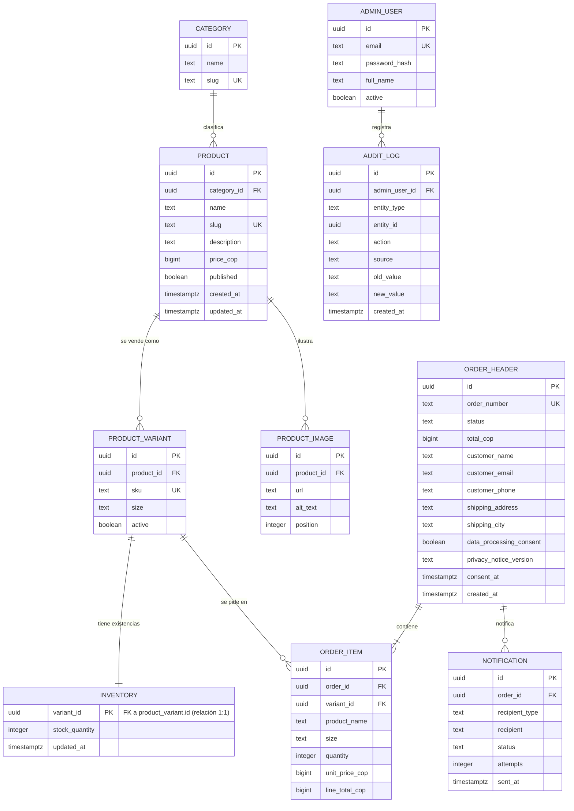

# Modelo entidad-relación

Modelo conceptual que soporta REQ-01 a REQ-08 y RNF-02. El detalle físico (tipos, restricciones, índices) está en [modelo-relacional.md](modelo-relacional.md); los conceptos, en [modelo-dominio.md](modelo-dominio.md).

Corresponde al entregable de **OE-2** («modelo entidad-relación») y a los componentes **C4** (base de datos relacional) y **C6** (auditoría) del PDF.

## Diagrama

## Entidades y propósito

| Entidad | Propósito | Requisitos | Reglas |
| --- | --- | --- | --- |
| `CATEGORY` | Agrupar productos para el filtro del catálogo. | REQ-01 | RN-04 |
| `PRODUCT` | Artículo ofrecido, con su estado de publicación. | REQ-01, REQ-06 | RN-01, RN-21, RN-23 |
| `PRODUCT_VARIANT` | Unidad vendible (talla). Referencia de carrito y órdenes. | REQ-01, REQ-02, REQ-03 | RN-05 |
| `INVENTORY` | Existencias por variante: fuente única de verdad. | REQ-03, REQ-06, RNF-02 | RN-02, RN-09, RN-10 |
| `PRODUCT_IMAGE` | Imágenes optimizadas del catálogo (C5). | REQ-01, REQ-06, RNF-01 | RN-22 |
| `ORDER_HEADER` | Orden confirmada con datos de entrega y consentimiento. | REQ-03, REQ-04, REQ-07, REQ-08 | RN-08, RN-13, RN-16, RN-28 |
| `ORDER_ITEM` | Línea de orden con copia de precio y descripción. | REQ-03 | RN-28, RN-29 |
| `ADMIN_USER` | Operador autenticado del panel. | REQ-06, RNF-04 | RN-19, RN-20 |
| `AUDIT_LOG` | Evidencia de variaciones de inventario y estados (C6). | REQ-06, REQ-07 | RN-24, RN-25, RN-27 |
| `NOTIFICATION` | Estado de los avisos de confirmación. | REQ-05 | RN-14, RN-15 |

## Decisión estructural: el inventario pertenece a la variante

El PDF exige filtrar por **talla** (REQ-01) y mostrar la disponibilidad real de cada producto (RN-02). Si las existencias colgaran del producto, el sistema no podría responder «quedan 2 en talla M y 0 en talla L», y la consistencia de RNF-02 se verificaría sobre un dato que no corresponde a lo que el comprador compra.

Por eso:

- `PRODUCT_VARIANT` es la unidad vendible;
- `INVENTORY` tiene relación 1:1 con la variante y su clave primaria es la propia `variant_id`;
- la disponibilidad de un producto es una **suma derivada**, nunca una columna almacenada en `PRODUCT`.

Registro completo de la decisión y sus alternativas: [`../decisiones/ADR-002-modelo-inventario.md`](../decisiones/ADR-002-modelo-inventario.md). `DECISIÓN PROPUESTA` — el PDF menciona «variantes» (Tabla 8) y filtros por talla, pero no fija dónde residen las existencias.

## Entidades evaluadas y descartadas

| Entidad candidata | Decisión | Razón |
| --- | --- | --- |
| `CART` / `CART_ITEM` | **No se crea** | El PDF define el carrito con persistencia en sesión; el servidor solo valida (RN-06). |
| `RESERVATION` | **No se crea** | Introduciría caducidad y un proceso de liberación que el PDF no contempla; la garantía la da la transacción (RN-08). |
| `CUSTOMER` | **No se crea** | No hay cuentas de comprador. Los datos mínimos viven en la orden, con finalidad declarada (RN-17). |
| `PAYMENT` | **No se crea** | El checkout es simulado y no se almacenan datos financieros (RN-12). |
| `SHIPMENT` | **No se crea** | La integración logística está excluida del alcance (PDF, Tabla 7). |
| `ROLE` / `PERMISSION` | **No se crea** | Existe un único perfil autenticado; ver nota 2 de `../requisitos/historias-usuario.md`. |
| `PRODUCT_ATTRIBUTE` genérico | **No se crea** | El único atributo de variante en el alcance es la talla; generalizar añadiría complejidad sin requisito que lo respalde. |
